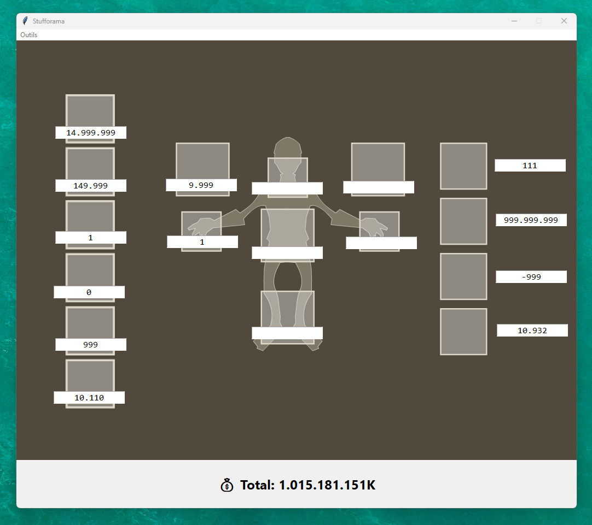

# Stufforama

**Stufforama** est un petit logiciel en **Python (Tkinter)** pour calculer en temps réel le prix de votre stuff sur **Dofus Rétro**.  
Vous remplissez les prix de vos objets (17 cases) et le total s’affiche automatiquement.

---

## Aperçu du logiciel



---

## 🔹 Fonctionnalités
- 17 cases pour saisir les prix des items.
- Formatage automatique avec des points (`.`) pour la lisibilité (ex: `1.234.567`).
- Total affiché en bas de l’interface.
- Fond visuel d’inventaire (modifiable).
- Mode placement (**touche P**) pour déplacer les cases et sauvegarder leur position.

---

## 🛠️ Installation

1. **Cloner le projet**
   ```bash
   git clone https://github.com/<ton-user>/Stufforama.git
   cd Stufforama
   ```

2. **Installer les dépendances**
   ```bash
   pip install -r requirements.txt
   ```

3. **Lancer l’application**
   ```bash
   python app/main.py
   ```

---

## 📂 Structure du projet

```
Stufforama/
│  README.md
│  requirements.txt
│  .gitignore
│
└─ app/
   ├─ assets/           # Images (inventaire, icône…)
   ├─ main.py           # Code principal
   └─ positions.json    # Coordonnées sauvegardées des champs
```

---

## 📜 Licence
Distribué sous licence **MIT**.  
Voir le fichier [LICENSE](LICENSE) pour plus d’informations.
